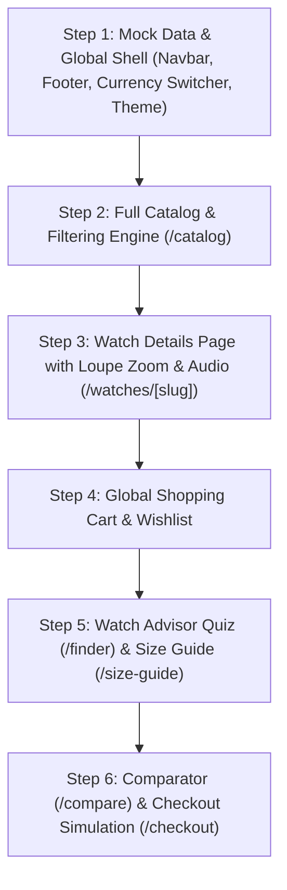

# XII — Luxury Timepiece E-Commerce: Suggested Pages & Features

## Core Mission
Build a world-class luxury watch e-commerce store with an **Architectural Brutalist** aesthetic, while mastering **Next.js 16 (App Router)**, **React 19**, and **Tailwind CSS v4**.

---

## 1. Streamlined Pages Lineup

| Route | Page Name | What It Is & Why It's Great |
| :--- | :--- | :--- |
| `/` | **Home (The Exhibition)** | Architectural hero section, curated timepiece drops, watch finder teaser, and brand story. |
| `/catalog` | **All Watches (Catalog & Filter)** | The central shop page showing all watches with instant search, category filters (Automatic, Chronograph, Tourbillon), material filters (Steel, Titanium, Gold), and price sorting. |
| `/watches/[slug]` | **Watch Details (Product Page)** | Individual watch page featuring high-res imagery, interactive macro zoom loupe, mechanical specs table, audio ticking sample, and "Add to Bag" / "Add to Wishlist". |
| `/finder` | **Watch Advisor (Quiz)** | A 3-step interactive questionnaire (*"Find Your Signature Timepiece"*) that matches the customer with recommended watches based on their style, wrist size, and budget. |
| `/size-guide` | **Wrist & Scale Guide** | An interactive tool where users slide their wrist size (e.g. 16cm to 20cm) to see a visual preview of how 38mm, 40mm, 42mm, and 44mm watch cases fit. |
| `/compare` | **Watch Comparator** | Pick 2 or 3 watches and compare their exact technical specifications side-by-side. |
| `/wishlist` | **Saved Collection** | Quick access to all bookmarked timepieces saved in local storage. |
| `/cart` & `/checkout` | **Shopping Bag & Checkout** | Sliding cart drawer + multi-step checkout with luxury armored shipping options and simulated order confirmation. |
| `/about` | **The Craft & Manifesto** | Editorial story page explaining movement engineering, sapphire crystal finishing, and brutalist horology design. |
| `/journal` | **Horology Journal** | Blog / Articles on watchmaking mechanics and history. |

---

## 2. Cool Feature Suggestions (Ranked by "Cool Factor" & Learning Value)

### 🌟 1. Interactive Macro Zoom (Loupe Lens)
- **What it does:** When hovering over the watch photo on the product page, the cursor turns into a round magnifying loupe that zooms into the dial texture, hands, and mechanism.
- **Why it's cool:** Feels like inspecting a real luxury watch with a jeweler’s loupe.
- **What you learn in React/Next.js:** Mouse position tracking, CSS coordinate transforms, and canvas/zoom overlays.

### 🌟 2. "Listen to the Caliber" (Audio Escapement Preview)
- **What it does:** A small speaker button on the watch page that plays the high-beat mechanical ticking sound (28,800 vph) or minute repeater chime of the watch.
- **Why it's cool:** Luxury watches are mechanical instruments—hearing the movement tick brings the site to life.
- **What you learn:** HTML5 Audio API in React, play/pause state, and animated soundwave indicators.

### 🌟 3. Watch Advisor Quiz (`/finder`)
- **What it does:** Users answer 3 quick questions (*Purpose: Daily / Black-Tie / Diving; Movement: Automatic / Manual; Material: Steel / Gold / Titanium*), and the app instantly filters and recommends the top 3 best matching watches.
- **Why it's cool:** Engaging customer onboarding flow common in luxury brands.
- **What you learn:** Multi-step wizard state, array filtering algorithms, and passing state between routes.

### 🌟 4. Interactive Wrist Size Guide (`/size-guide`)
- **What it does:** A slider for wrist circumference that dynamically renders how a 38mm, 40mm, 42mm, or 45mm case sits relative to lug-to-lug width.
- **Why it's cool:** Solves the #1 question watch buyers have online: *"Will this watch be too big for my wrist?"*
- **What you learn:** Controlled sliders, SVG scaling, and responsive layout math.

### 🌟 5. Currency Switcher (USD $, EUR €, GBP £, CHF Fr, JPY ¥)
- **What it does:** A dropdown in the header that converts all prices across the entire website on the fly.
- **Why it's cool:** Real luxury watch sites serve international collectors in Switzerland, London, New York, and Tokyo.
- **What you learn:** React Context API, global state sharing, and number formatting (`Intl.NumberFormat`).

### 🌟 6. Wishlist / Favorites System
- **What it does:** Heart icon on every watch card to save favorites, with a counter badge in the navbar and a dedicated `/wishlist` page.
- **Why it's cool:** Essential e-commerce feature.
- **What you learn:** `localStorage` synchronization, custom React hooks (`useWishlist`), and optimistic UI updates.

---

## 3. Recommended Development Order

